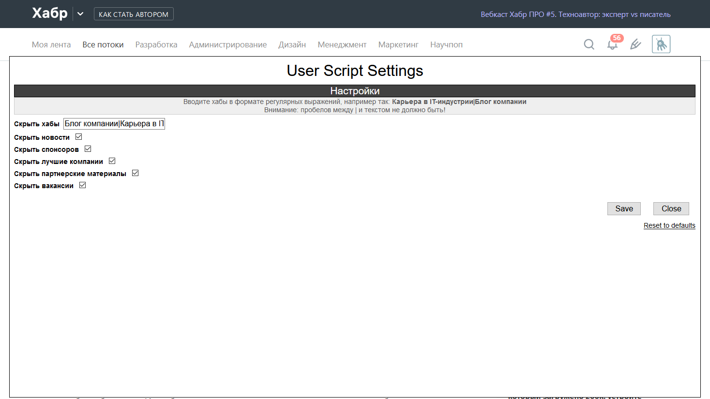
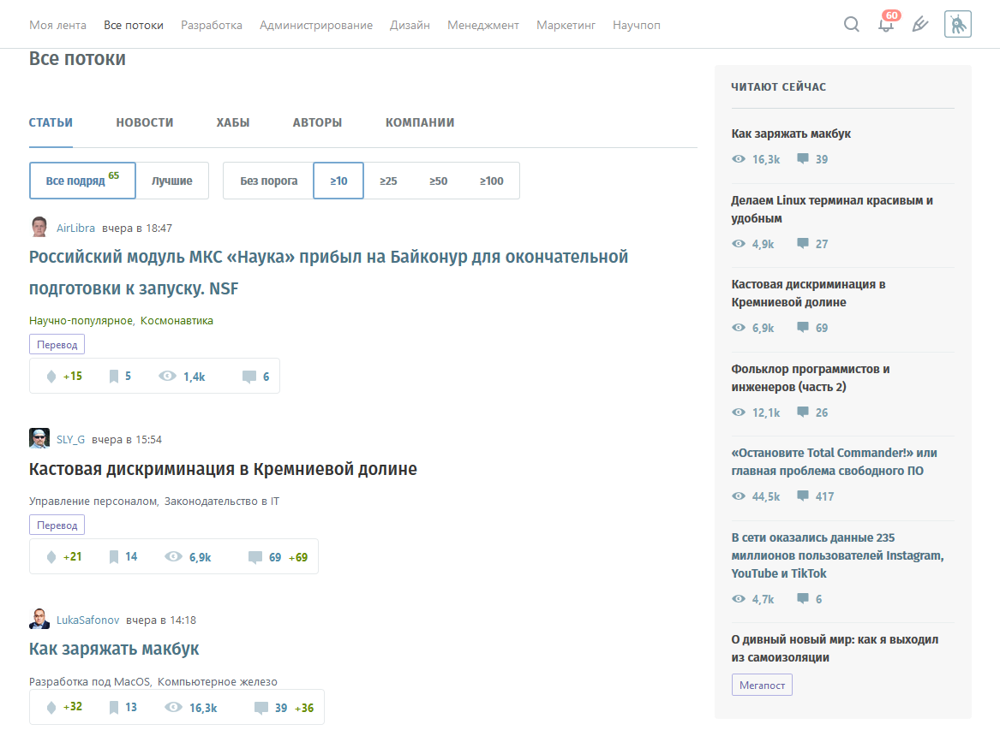

# HabrHider

Скрывайте посты от неугодных вам хабов и блогов на главной, новости, промоматериалы и прочие!

## Что может скрипт:
* Скрывать хабы. 

    Для этого необходимо вписать в поле ввода несложную регулярку, например, `Блог компании|Карьера в IT`

* Скрывать новости
* Скрывать колонку спонсоров и лучших компаний
* Скрывать все промоматериалы, такие как 'Курсы', 'Заказы', 'Минуточку внимания' и прочие.
* Есть возможность отображать только заголовки статей.

## Как это выглядит
